# -01-setup-environtment-react
2241720062-Yunila Putmasari-Pem Berbasis Framework 2024

## Pertanyaan Praktikum 1

**1. Jelaskan kegunaan masing-masing dari Git, VS Code dan NodeJS yang telah Anda install pada sesi praktikum ini!**
- **Git** : Git adalah sistem kontrol versi (VCS) yang digunakan untuk melacak perubahan kode dalam pengembangan perangkat lunak. Kegunaannya meliputi:
    - Mengelola proyek secara kolaboratif dengan banyak developer.
    - Menyimpan riwayat perubahan kode sehingga bisa dikembalikan ke versi sebelumnya.
    - Berintegrasi dengan layanan seperti GitHub, GitLab, dan Bitbucket untuk pengelolaan repositori online.

- **VS Code**: VS Code (Visual Studio Code) adalah editor kode sumber yang populer digunakan oleh pengembang perangkat lunak.
- **Node.js** adalah platform JavaScript yang berfungsi untuk menjalankan JavaScript di luar browser. Node.js dapat digunakan untuk: 
    - Mengembangkan aplikasi web berbasis server
    - Membangun aplikasi jaringan dan server-side real-time
    - Membangun aplikasi berbasis mikroservis
    - Membangun API (Application Programming Interface) server
    - Membangun server HTTP
    - Membangun User Interface (UI)
**2. Buktikan dengan screenshoot yang menunjukkan bahwa masing-masing tools tersebut telah berhasil terinstall di perangkat Anda!**
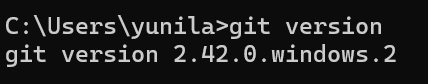
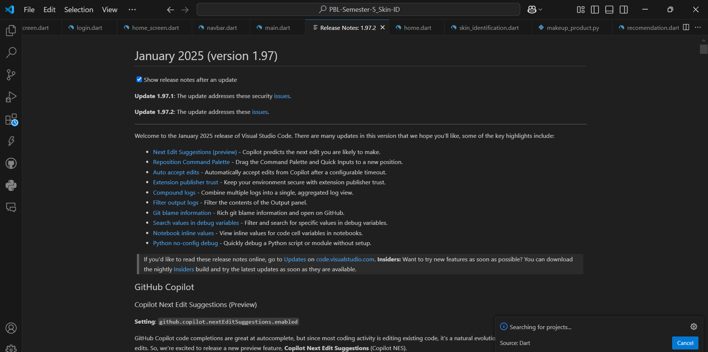

## Pertanyaan Praktikum 2

**1. Pada Langkah ke-2, setelah membuat proyek baru menggunakan Next.js, terdapat beberapa istilah yang muncul. Jelaskan istilah tersebut, TypeScript, ESLint, Tailwind CSS, App Router, Import alias, App router, dan Turbopack!**

- TypeScript : TypeScript adalah bahasa pemrograman yang dikembangkan oleh Microsoft sebagai superset dari JavaScript
- ESLint : Alat untuk mengecek kode JavaScript agar lebih rapi, terstruktur, dan bebas dari kesalahan. Misalnya, kalau ada kesalahan sintaks atau gaya penulisan yang tidak konsisten, ESLint akan memberikan peringatan.
- Tailwind CSS : Framework CSS yang membuat pengaturan tampilan website lebih cepat. Dibandingkan menulis CSS panjang-panjang, kita cukup pakai class bawaan seperti bg-blue-500 untuk memberi warna biru atau p-4 untuk padding.
- App Router : Fitur di Next.js yang memungkinkan kita membuat dan mengatur halaman dengan lebih mudah menggunakan sistem routing berbasis folder.
- Import alias : Fitur di Next.js yang memudahkan kita mengimpor file tanpa harus menulis path panjang.
- App router : App router adalah fitur Next.js yang memungkinkan Anda untuk membuat
- Turbopack : Turbopack adalah alat yang membuat Next.js lebih cepat saat menjalankan dan memperbarui kode.Turbopack lebih cepat karena hanya memperbarui bagian kode yang berubah.

**2. Apa saja kegunaan folder dan file yang ada pada struktur proyek React yang tampil pada gambar pada tahap percobaan ke-3!**
- .next/ : Folder ini dibuat otomatis setelah menjalankan npm run build atau npm run dev. Berisi file hasil build dan cache untuk mempercepat pengembangan.
- node_modules/ : Berisi semua package atau library yang diinstal melalui npm install. Jangan edit isi folder ini secara manual.
- public/ : Tempat menyimpan file statis seperti gambar, ikon, atau favicon. Semua file di dalam folder ini bisa diakses langsung melalui browser.
- src/ : Tempat utama untuk menyimpan kode proyek. Biasanya berisi folder app/ (untuk Next.js 13+ dengan App Router) atau pages/ (untuk Next.js 12 atau sebelumnya).
- .gitignore : Menentukan file/folder yang tidak perlu dikirim ke GitHub, misalnya node_modules/ dan .next/.
- eslint.config.mjs : Konfigurasi untuk ESLint (alat untuk memeriksa dan memperbaiki kode JavaScript/TypeScript agar sesuai standar).
- next-env.d.ts : File deklarasi TypeScript untuk memastikan kompatibilitas dengan Next.js.
- next.config.ts : File konfigurasi Next.js, seperti pengaturan custom webpack, base path, dan lain-lain.
- package.json & package-lock.json :
 package.json → Berisi daftar dependensi dan skrip yang bisa dijalankan (npm run dev, npm run build).
package-lock.json → Mengunci versi package agar konsisten saat diinstal.
- postcss.config.mjs : Konfigurasi untuk PostCSS, biasanya digunakan dengan Tailwind CSS untuk memproses CSS. 
- README.md : Dokumentasi proyek, biasanya berisi cara instalasi dan penggunaan proyek.
- tsconfig.json : Konfigurasi untuk TypeScript, menentukan aturan seperti strict mode, path alias, dll.

**3. Buktikan dengan screenshoot yang menunjukkan bahwa tahapan percobaan di atas telah berhasil Anda lakukan!**

- pembuatan proyek baru dengan Next.js
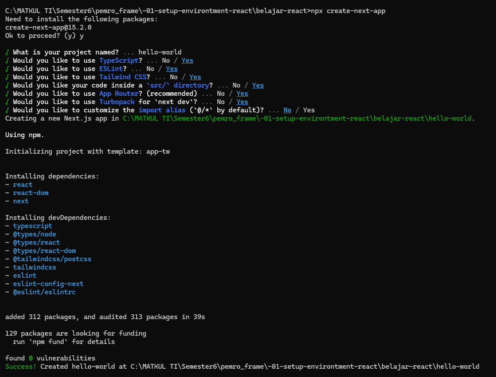
- isi dari proyek
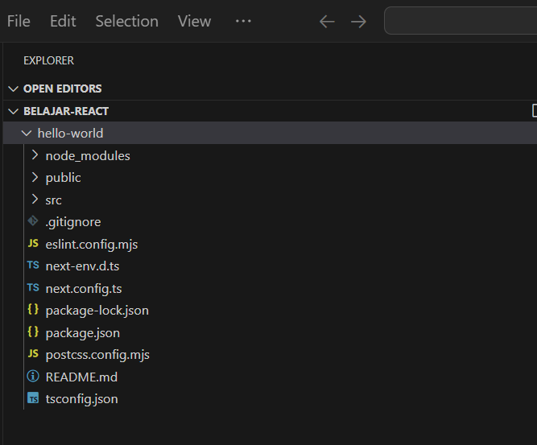
- bukti keerhasilan npm run dev
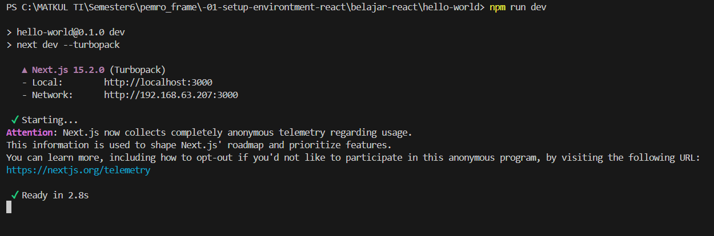
- cek di localhost:3000
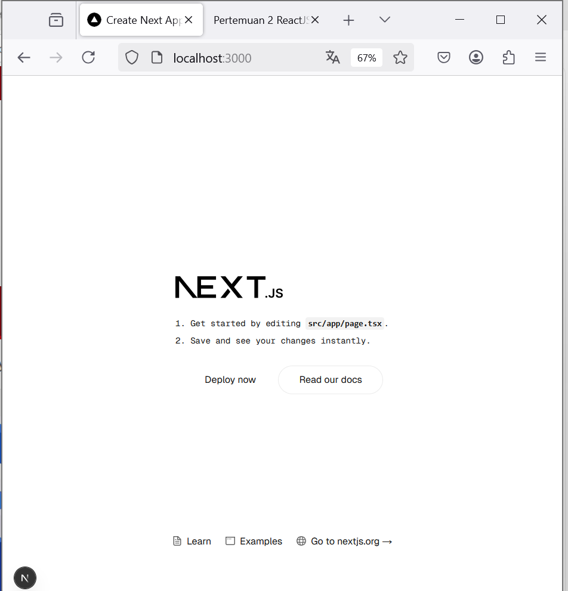

## Pertanyaan Praktikum 3
**1. Buktikan dengan screenshoot yang menunjukkan bahwa tahapan percobaan di atas telah berhasil Anda lakukan!**
- penulisan fungsi diluar komponen
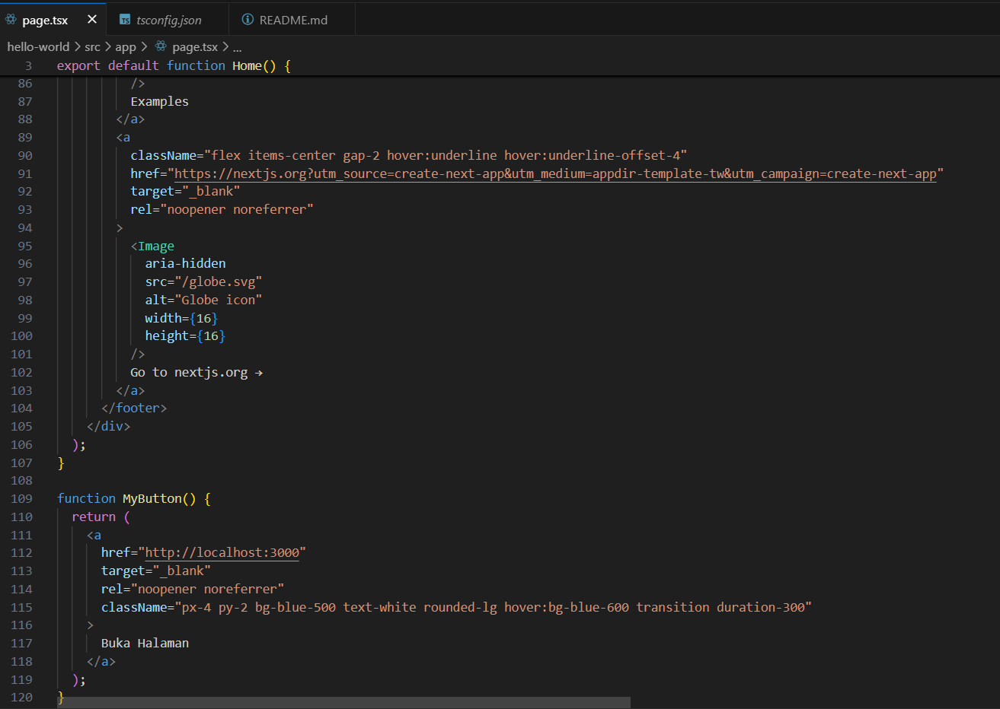
- pemanggilan fungsi MyButton di dalam tag <a> 
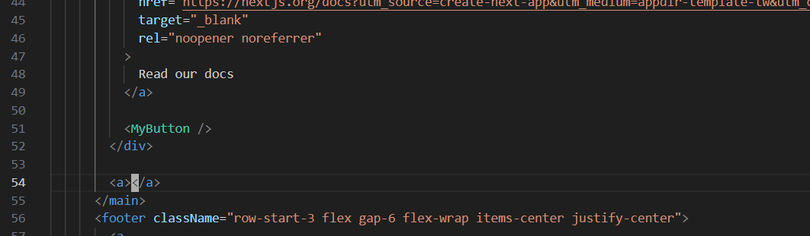
- hasilnya
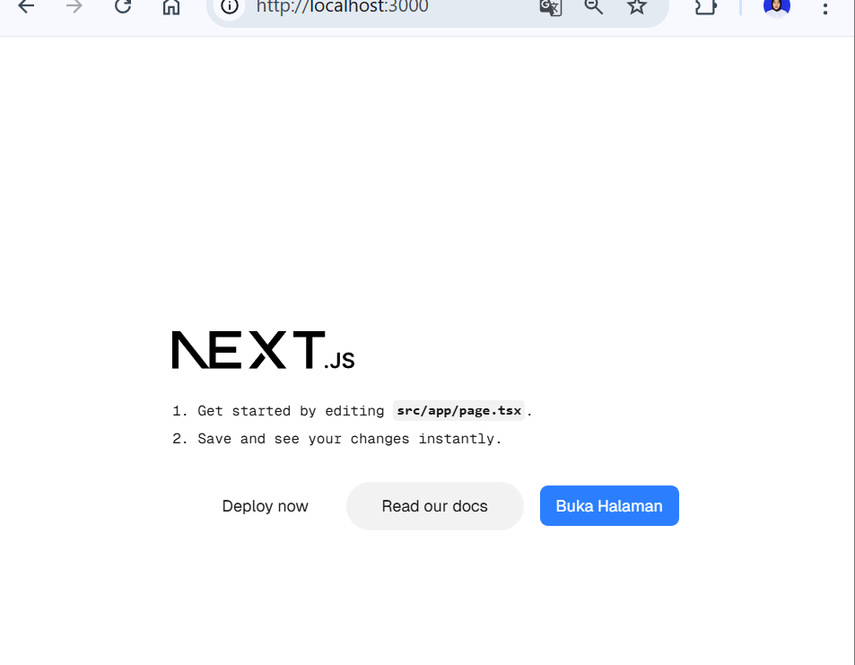

## Pertanyaan Praktikum 4
**1. Untuk apakah kegunaan sintaks user.imageUrl?**
- Untuk menampilkan gambar profil pengguna di aplikasi.

**2. Buktikan dengan screenshoot yang menunjukkan bahwa tahapan percobaan di atas telah berhasil Anda lakukan!**
-  penulisan fungsi diluar komponen
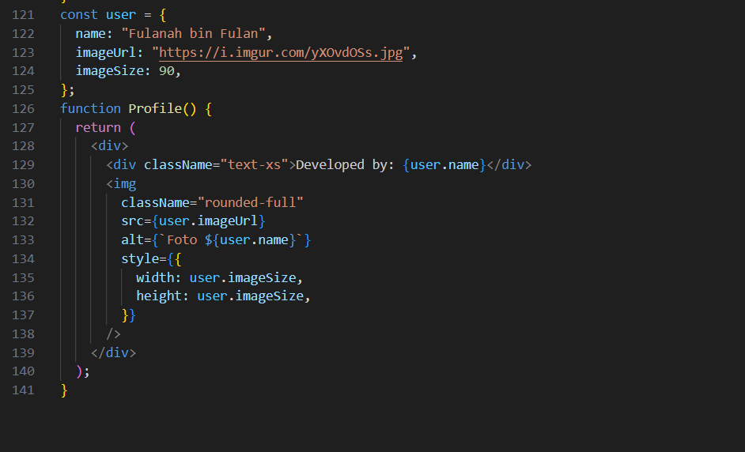
- pemanggilan fungsi MyProfile di dalam tag <a>
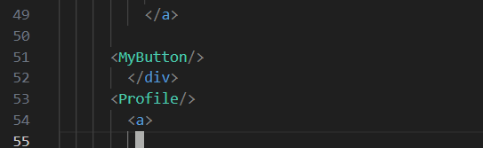
- hasilnya
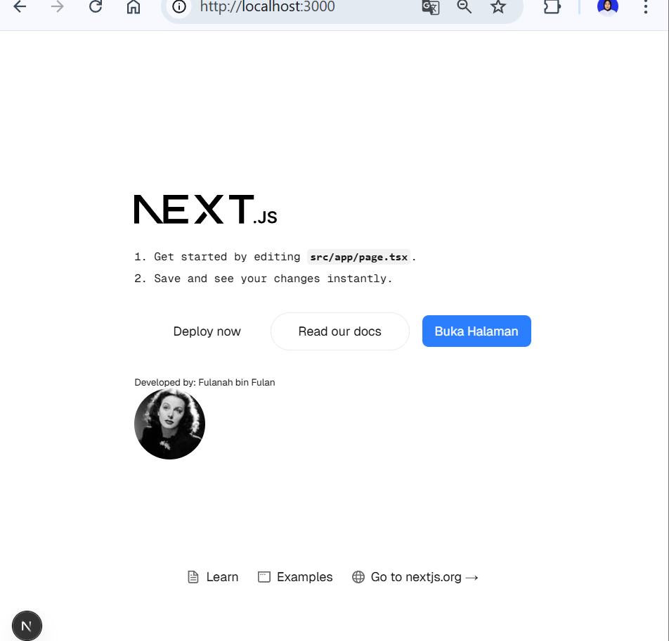

